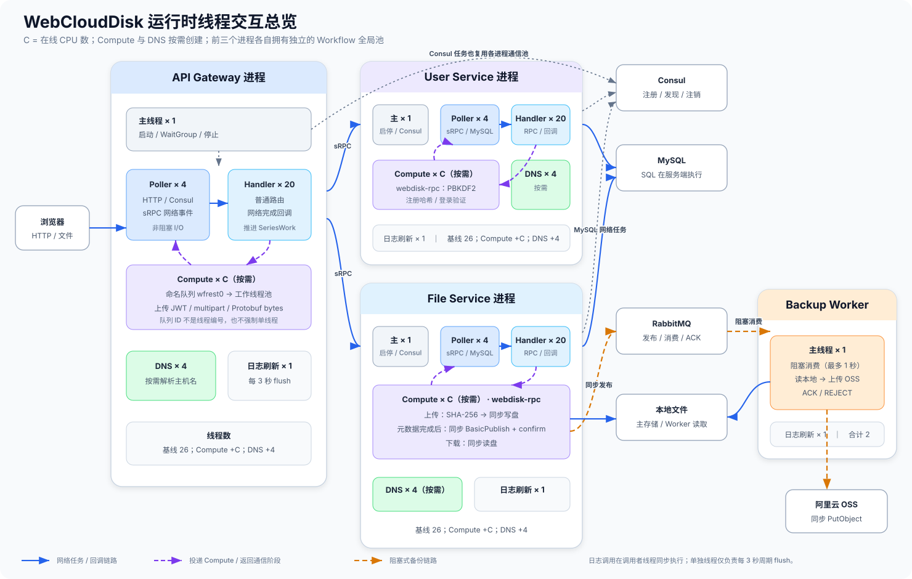
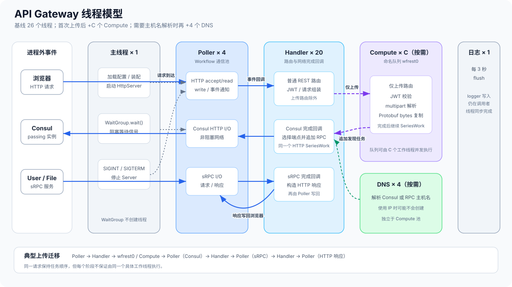
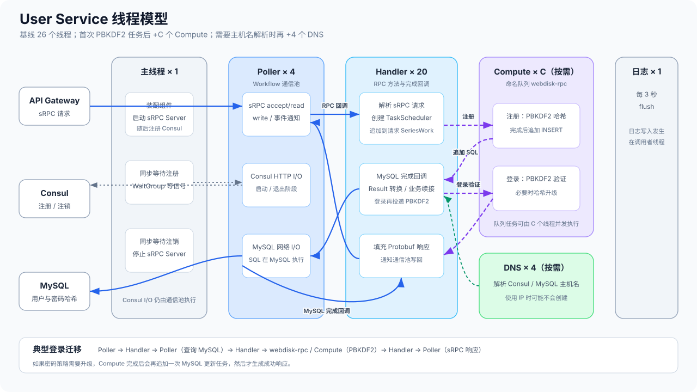
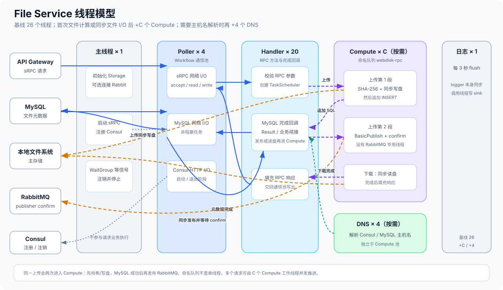
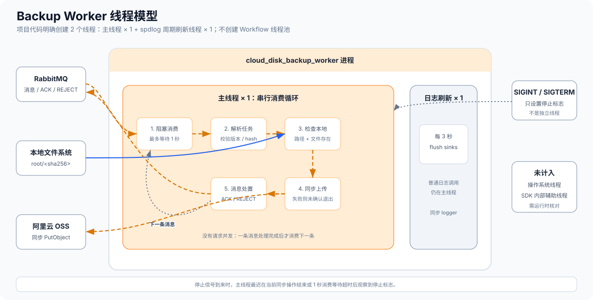

# 运行时进程与线程模型

本文描述 WebCloudDisk 自身及其直接使用的 Workflow、wfrest、sRPC 和 spdlog 所管理的线程。MySQL、Consul、
RabbitMQ 和 OSS 是进程外服务，不属于 WebCloudDisk 线程；操作系统、libcurl 或云 SDK 可能创建的内部辅助线程
也不计入下面的静态模型。



图中的箭头表示任务和回调在哪类线程之间迁移，并不表示请求与某个固定线程绑定。一次请求由 `SeriesWork` 保持
任务顺序，前后阶段可能由不同的 Handler、Poller 或 Compute 工作线程执行。

## 默认线程数

项目没有调用 `WORKFLOW_library_init()`，因此三个网络服务进程分别使用 Workflow 默认设置。令 `C` 为
`sysconf(_SC_NPROCESSORS_ONLN)` 返回的在线 CPU 数：

| 进程 | 主线程 | Poller | Handler | Compute | DNS | 日志刷新 | 线程数公式 |
| --- | ---: | ---: | ---: | ---: | ---: | ---: | --- |
| API Gateway | 1 | 4 | 20 | `C`，首次上传时创建 | 4，解析主机名时创建 | 1 | 常驻基线 `26`；Compute 活跃后 `26 + C`；DNS 也活跃时 `30 + C` |
| User Service | 1 | 4 | 20 | `C`，首次密码计算时创建 | 4，解析主机名时创建 | 1 | 常驻基线 `26`；Compute 活跃后 `26 + C`；DNS 也活跃时 `30 + C` |
| File Service | 1 | 4 | 20 | `C`，首次文件计算或同步文件 I/O 时创建 | 4，解析主机名时创建 | 1 | 常驻基线 `26`；Compute 活跃后 `26 + C`；DNS 也活跃时 `30 + C` |
| Backup Worker | 1 | — | — | — | — | 1 | 项目代码明确创建 `2` 个；第三方 SDK 内部线程不在此模型中 |

四个进程同时运行时，表中可确认的常驻基线合计为 `3 × 26 + 2 = 80`；三个 Compute 池都已创建时为
`80 + 3C`；三个 DNS 池也都已创建时为 `92 + 3C`。这个合计仍不包含操作系统或第三方 SDK 的内部辅助线程。

这里的“常驻基线”指日志初始化且网络服务启动后，由项目和上述框架可直接确认的线程。Compute 和 DNS 管理器
采用懒初始化；是否已经创建取决于进程是否执行过对应任务。三个网络服务虽然线程数相同，但每个进程拥有独立的
Workflow 全局池，不共享线程。

`wfrest0` 和 `webdisk-rpc` 是进程内的命名计算任务队列，不是线程名，也不表示单线程执行。队列把任务投递到
本进程的 `C` 个 Compute 工作线程；同名的 `webdisk-rpc` 在 User Service 和 File Service 中也是两个互不相关的
进程内对象。

## API Gateway



- 主线程完成配置、组件装配和 HTTP Server 启停，随后在 `WaitGroup` 上等待退出信号。
- Poller 处理浏览器 HTTP、Consul HTTP 与 sRPC socket 的事件；Handler 执行普通路由及这些网络任务的完成回调。
- 上传路由先由 wfrest 投递到 `wfrest0`，在 Compute 线程中完成 JWT 校验、multipart 解析和 Protobuf 内容复制；
  随后把 Consul 发现任务和 sRPC 任务追加到同一个 HTTP `SeriesWork`。
- 普通注册、登录、查询和下载路由不进入 Gateway 的 Compute 池；它们在 Handler 中组装请求，再通过 Workflow
  通信线程完成发现和 RPC。

## User Service



- sRPC 请求由 Poller 接收，Handler 调用 RPC 方法并向当前请求的 `SeriesWork` 追加后续任务。
- 注册把 PBKDF2 哈希投递到 `webdisk-rpc`，完成后追加 MySQL 任务；登录先查 MySQL，再把 PBKDF2 验证投递到
  同一计算队列，必要时再追加一次密码哈希升级 SQL。
- MySQL 网络收发由 Poller 推进，结果回调由 Handler 执行；SQL 本身运行在 MySQL 服务端，而不是本进程线程中。
- 主线程在 RPC Server 启动后同步等待 Consul 注册任务，退出时同步等待注销；这些任务仍复用本进程的 Workflow
  通信线程。

## File Service



- 上传请求进入 `webdisk-rpc` 后计算 SHA-256 并同步写本地文件，再通过 Workflow 通信线程写入 MySQL 元数据。
- 元数据成功后再次进入 Compute 池，同步等待 RabbitMQ publisher confirm；发布失败只记录日志，不撤销本地上传。
- 下载先异步查询 MySQL，再进入 Compute 池同步读取本地文件，最后由 sRPC/Workflow 通信线程发送响应。
- RabbitMQ 发布器没有专用线程；它由当前 Compute 工作线程调用，并用互斥锁保护单个 Channel。

## Backup Worker



- 主线程执行整个消费循环：最多阻塞 1 秒等待 RabbitMQ 消息，解析任务，检查本地内容，同步上传 OSS，最后
  `ACK` 或 `REJECT`。
- `SIGINT`/`SIGTERM` 处理函数只设置停止标志，不创建线程；主线程在每次消费等待超时后检查该标志。
- Worker 不创建 Workflow 的 Poller、Handler、Compute 或 DNS 池。日志仍是同步 logger，另有 1 个 spdlog
  周期刷新线程每 3 秒执行一次 flush。

## 如何核对某次真实运行

静态模型适合解释代码，但实际线程数还会受 CPU 数、懒初始化和第三方库实现影响。需要核对某次部署时，可以先取
进程 PID，再查看线程列表：

```bash
# Linux
ps -L -p <pid> -o pid,tid,comm

# macOS
ps -M <pid>
```

为了同时观察线程数与请求阶段，建议保留当前日志格式中的线程 ID，并分别触发一次普通查询、上传、登录和备份任务；
这样可以看到 Compute 与 DNS 池是否已经按需创建，以及同一请求如何跨线程角色继续执行。
